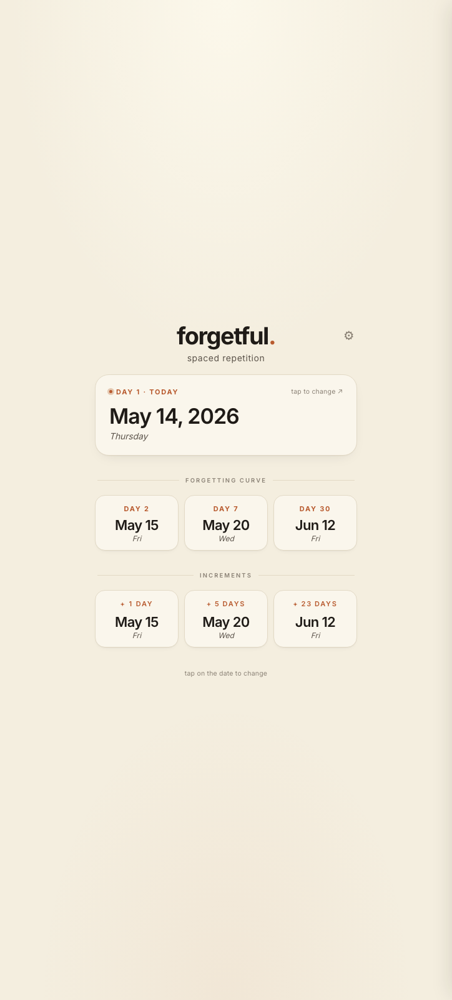
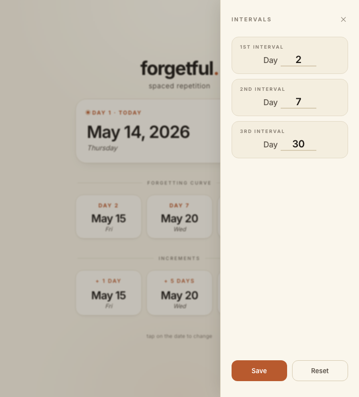

# forgetful.

A spaced repetition tool for things worth remembering.

---

## What it does

You set a date — the day you learned a few words in a foreign language, worked on a math problem, read something that mattered. forgetful then shows you when to revisit it.

These intervals follow Ebbinghaus's forgetting curve: the idea that memory decays predictably, and that reviewing at the right moments locks information in before it slips away.

There are three sections:

- **Anchor (Day 1)** — your start date. Tap to change it.
- **Forgetting Curve** — three review checkpoints (Day 2, Day 7, Day 30 by default), each dated from your anchor. Tap ⚙ to customise the intervals.
- **Increments** — the day gaps between each checkpoint, for a quick sense of spacing.

## How to use it

1. Tap the anchor card to set your start date
2. The forgetting curve shows your Day 2, Day 7, and Day 30 review dates
3. Tap ⚙ to open the interval editor and adjust the three checkpoints
4. Use the dates as reminders to revisit whatever you're trying to hold onto



Tap the ⚙ icon to customize the intervals:



## Stack

A single `index.html` — no build step, no dependencies, no backend. Open it in a browser and it works.

- Vanilla JS for state and rendering
- Inter for all type
- CSS custom properties for theming
- Native date picker for input

## Use it online

Visit [forgetful.pages.dev](https://forgetful.pages.dev/) to use the app.

## Local use

```
open index.html
```

Or serve it:

```
python3 -m http.server 8000
```

---

*Quiet. Lowercase. No notifications.*
